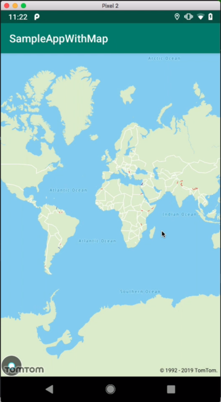

# TomTom Maps SDK for Android - Search along a route

This tutorial shows how to use TomTom Maps SDK for Android to create an application that helps a user find points of interest along a planned route.

It shows how to use:

* The TomTom Map SDK module to display a map, including markers with custom icons and balloons.
* The TomTom Routing SDK module to plan routes with and without waypoints.
* The TomTom Search SDK module to search for points of interest (POIs) and to geocode map positions.

An end user can start interacting with the application by planning a route with departure and destination points. One long click on the map sets a departure point. A second long click sets a destination point and draws a route between those two points on the map.

When the route is visible on the map, the user can type a POI name or category into a search field or click on any of the predefined POI category buttons (gas station, restaurant, ATM). The map displays markers for POIs that match the user's request. The user can add one of the displayed POIs to their planned route by clicking the marker on the map and choosing the "Add to my route" button inside the marker balloon that is then displayed. The route is recalculated and redrawn to include the selected point.

## Requirements

* [Android Studio](https://developer.android.com/studio)

## Credits

This package was created with [Cookiecutter](https://github.com/cookiecutter/cookiecutter) and the [tomtom-international/cookiecutter-android](https://github.com/tomtom-international/cookiecutter-android) project template.
